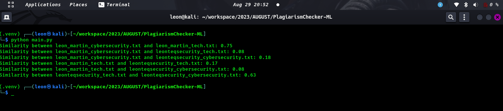

# Plagiarism Checker - Technology and Cybersecurity

This repository contains a simple plagiarism checker using python and machine learning

## Sample Text Files

The repository includes the following sample `.txt` files to demonstrate plagiarism checking:

1. `leon_martin_tech.txt`: Leon Martin's perspective on technology for LeonteqSecurity.
2. `leon_martin_cybersecurity.txt`: Leon Martin's perspective on cybersecurity for LeonteqSecurity.
3. `leonteqsecurity_tech.txt`: LeonteqSecurity's official document about their technology approach.
4. `leonteqsecurity_cybersecurity.txt`: LeonteqSecurity's official document about their cybersecurity measures.

# Results


## Usage

1. Clone the repository to your local machine:

```bash
git clone git@github.com:leonTech254/PlagiarismChecker-ML.git
```
### navigate to the repository
```bash
cd PlagiarismChecker-ML
```
### install the requirements
```bash
pip3 install requirement.txt
```
### Run the plagiarism checker script
```bash
python3 main.py
```
